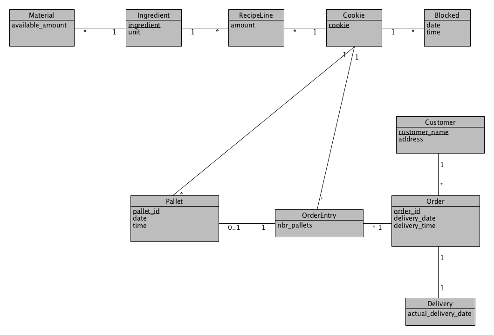

# EDAF75, project report

This is the report for

 + Andreas Timurtas, `an0173ti-s`
 + Jakob Henningsson, `ja7241he-s`
 + Felicia Segui, `fe7744se-s`

We solved this project on our own, except for:

 + Some feedback and suggestions regarding triggers and the ER-model from Christian via email 


## ER-design

The model is in the file [`er-model.png`](er-model.png):

<center>
    
</center>

The ER-model that was used when the database for Krusty Kookies was built.


## Relations

The ER-model above gives the following relations (neither
[Markdown](https://docs.gitlab.com/ee/user/markdown.html)
nor [HTML5](https://en.wikipedia.org/wiki/HTML5) handles
underlining withtout resorting to
[CSS](https://en.wikipedia.org/wiki/Cascading_Style_Sheets),
so we use bold face for primary keys, italicized face for
foreign keys, and bold italicized face for attributes which
are both primary keys and foreign keys):

+ materials(available_amount, **_ingredient_**)
+ ingredients(**ingredient**, unit)
+ recipe_lines(amount, **_ingredient_**, **_cookie_**)
+ cookies(**cookie**)
+ blocked(**blocked_id**, blocked_date, blocked_time, _cookie_)
+ pallets(**pallet_id**, pallet_date, pallet_time, _cookie_, _order_entry_id_)
+ order_entries(**order_entry_id**, nbr_pallets, _cookie_, _order_id_)
+ orders(**order_id**, tot_nbr_pallets, delivery_date, delivery_time, _customer_name_, _delivery_id_)
+ customers(**customer_name**, address)
+ deliveries(**delivery_id**, actual_delivery_date, _order_id_)


## Scripts to set up database

The scripts used to set up and populate the database are in:

 + [`create-schema.sql`](create-schema.sql) (defines the tables), and
 + [`initial-data.sql`](initial-data.sql) (inserts data).

So, to create and initialize the database, we run:

```shell
sqlite3 krusty_kookies.sqlite < create-schema.sql
sqlite3 krusty_kookies.sqlite < initial-data.sql
```


## How to compile and run the program

After downloading folder with project, open a terminal and run:

```shell
cd PARTH_TO_FOLDER_WITH_SERVER_SCRIPT
python rest_api.py
```


